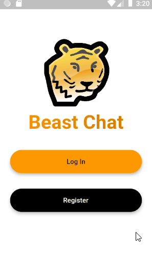

# Beast Chat   

A simple chat app that uses Firebase Firestore as backend.

## Note

This repository does not include google-services.json file, to protect sensitive account details. You can clone this repository and create your an account on Firebase console to retrieve a new google-services.json

